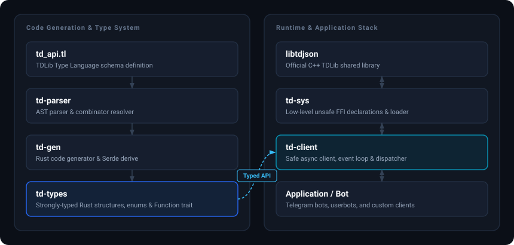

# td

**Build full Telegram clients in Rust without reducing TDLib to stringly typed JSON.**

`td` generates a typed Rust API from [TDLib]'s [API schema][td-api], written in Telegram's [Type Language (TL)][tl], and connects it to a small asynchronous client runtime. TDLib handles the protocol, synchronization, local storage, and media; `td` handles the Rust-facing boundary: request types, response correlation, ordered updates, message-send completion, and explicit shutdown.

This is a native TDLib integration, not an HTTP Bot API wrapper. It can power user clients, bots, and automation that need TDLib's full client capabilities.

Lonami's [grammers] and [Telethon] have both been a huge inspiration for this project.

## What you get

- Requests statically paired with their response types, generated from TDLib's [`td_api.tl`][td-api] schema.
- Concurrent requests and multiple independent clients routed through TDLib's single process-wide receiver.
- Ordered application updates with no library-defined dropping, retry, or logging policy.
- `sendMessage` helpers that wait for Telegram's terminal success, failure, or deletion update instead of reporting a temporary local message as delivered.
- One non-cloneable lifecycle owner, cloneable request-only senders, and fallible graceful shutdown.

## Architecture



Most applications use only [`td-client`](td-client) and [`td-types`](td-types). The left side of the diagram runs at build time; the right side is the live request and update path.

## Get started

The bundled fetch path supports x86-64 and ARM64 on Linux with glibc and on macOS. It requires [Rust 1.97][rust], plus `curl`, `jq`, and `tar`; Linux also needs `readelf`.

Fetch the native library and its matching schema before building:

```bash
./td/fetch
```

The [`td/fetch`](td/fetch) script downloads the latest matching [`prebuilt-tdlib`][prebuilt-tdlib] package and [upstream schema][td-api]. Both artifacts stay local and are ignored by Git.

To run the echo bot, add [Telegram application credentials][telegram-apps] and a [bot token][botfather] to its ignored [configuration](td-client/examples/bot/config.example.json):

```bash
cp td-client/examples/bot/config.example.json td-client/examples/bot/config.json
cargo run -p td-client --example echo
```

The example authenticates a bot, logs incoming updates, and replies to text messages only after each reply reaches a terminal send result. Its complete source is [`td-client/examples/echo.rs`](td-client/examples/echo.rs).

## Core usage

Generated request structs carry their return type, so no response cast or hand-written JSON is needed:

```rust
use td_client::{Client, Result, defaults};
use td_types::enums::User;
use td_types::{fns, types};

#[tokio::main(flavor = "current_thread")]
async fn main() -> Result {
  let params = fns::setTdlibParameters {
    api_id: 123456,
    api_hash: "your API hash".into(),
    ..defaults()
  };
  let client = Client::bot(params, "your bot token").await?;

  // Keep application errors separate from lifecycle cleanup.
  let result = identify(&client).await;
  let shutdown = client.shutdown().await;
  result?;
  shutdown
}

async fn identify(client: &Client) -> Result {
  let sender = client.sender();
  let User::user(types::user { id, first_name, .. }) = sender.send(&fns::getMe {}).await?;
  println!("signed in as {first_name} ({id})");
  Ok(())
}
```

The runtime deliberately has a small public vocabulary:

| Operation | Meaning |
| --- | --- |
| `Client::new` | Apply TDLib parameters; the caller drives authorization. |
| `Client::bot` | Apply parameters and complete the bot-token flow. |
| `Client::sender` | Create a cloneable, non-owning request capability. |
| `Sender::send` | Return a generated function's direct correlated response. |
| `Sender::send_message` | Return the final sent message, or its terminal failure. |
| `Sender::send_message_until` | Enforce an absolute deadline through compensating deletion. |
| `Client::recv` | Receive the next ordinary update in TDLib order. |
| `Client::recv_auth` | Receive the next authorization state without losing ordinary updates. |
| `Client::shutdown` | Consume the owner and complete TDLib's close protocol. |

### Requests and updates

Clone `Sender` into detached tasks when work must continue independently of the update loop. A sender stores only a weak reference: it cannot receive updates, initiate shutdown, or keep a client alive. Requests that race with shutdown are either sent before `close` or rejected with `Error::Disconnected`.

One mutable `Client` drains the ordered update stream. `recv_auth` temporarily buffers non-authorization updates, and `recv` later returns them in their original order. Authorization transitions themselves are not exposed through the ordinary update stream.

The update queue is unbounded by design. TDLib's synchronous receiver cannot await capacity, and choosing which updates to delay, spill, or discard is application policy. Keep the receive loop moving and dispatch slow work separately.

### Message completion and cancellation

TDLib's direct `sendMessage` response contains a temporary local message. Use `Sender::send_message` for the authoritative final message; use `Sender::send` with `sendMessage` only when the pending response or a preview is intentionally required. Message edits and deletions already complete through their direct responses and also use `send`.

`send_message_until` deletes the temporary message if its deadline wins and also deletes the final message if success races with cancellation. This is compensating cleanup, not a server-atomic operation: a recipient can briefly observe a concurrently delivered message, and the future may finish after the deadline while cleanup completes.

Dropping a request or tracked-send future abandons only the Rust waiter. It does not cancel work already submitted to TDLib. Deadline cleanup likewise progresses only while its future is polled.

### Authorization and shutdown

`Client::bot` is the narrow convenience path. For user accounts or custom authorization, construct with `Client::new`, read states with `recv_auth`, and send the corresponding generated authentication functions.

Always call `Client::shutdown`. It sends the generated `close` request, waits for `authorizationStateClosed`, revokes request senders, unregisters the client, and waits for the process-wide receiver to reach a safe handoff point. `Drop` intentionally performs no native work and does not claim a graceful shutdown.

## Generated API

[`td-types`](td-types) exposes four useful namespaces:

| Namespace | Contents |
| --- | --- |
| `fns` | Request structs such as `getMe` and `sendMessage`. |
| `types` | Concrete TDLib object structs. |
| `enums` | Tagged unions such as `Update`, `MessageContent`, and `User`. |
| `traits::Function` | The request-to-response type association used by `Sender::send`. |

Generated names intentionally preserve TDLib spelling, including lowercase constructor structs and variants. Objects and enums implement Serde serialization and deserialization; requests serialize and declare their deserializable return type. The wire adapters preserve TDLib's JSON representation for 64-bit integers, bytes, nullable fields, and tagged objects.

Detailed workspace API documentation is generated and published by [`td/docs`](td/docs).

## Workspace

| Crate | Responsibility |
| --- | --- |
| [`td-client`](td-client) | Typed async requests, ordered updates, authorization, terminal message sends, and lifecycle. |
| [`td-types`](td-types) | Generated requests, responses, objects, updates, [Serde] implementations, and upstream documentation. |
| [`td-sys`](td-sys) | Raw unsafe bindings to TDLib's JSON C API plus native linking configuration. |
| [`td-parser`](td-parser) | A purpose-built, mostly borrowed parser for the [TDLib Type Language schema][td-api]. |
| [`td-codegen`](td-codegen) | Deterministic Rust generation and recursive-layout analysis. |

`td-parser`, `td-codegen`, and `td-types` form the build-time pipeline. The schema remains the source of generated code; generated output is never patched by hand.

## Build and test

After running [`td/fetch`](td/fetch), the normal repository checks need no Telegram credentials:

```bash
cargo fmt --all --check
cargo check --workspace
cargo test --workspace
cargo clippy --workspace --all-targets
```

The ignored [live test](td-client/tests/live.rs) exercises a real bot and dedicated chat. Copy its [configuration](td-client/tests/live/config.example.json), provide `api_id`, `api_hash`, `bot_token`, and `chat_id`, and ensure [FFmpeg] is on `PATH` for generated media fixtures:

```bash
cp td-client/tests/live/config.example.json td-client/tests/live/config.json
cargo test -p td-client --test live -- --ignored --test-threads=1 --nocapture
```

It covers text send/edit/delete, common media uploads, forced-document behavior, terminal update preservation, and deadline cleanup. Authorization is retained in `td-client/tests/live/session`; delete that ignored directory when changing bot accounts.

To emit a standalone generated API file at `td/td_api.rs` for inspection, run the [code-generation integration test](td-codegen/tests/codegen.rs):

```bash
cargo test -p td-codegen --test codegen upstream
```

## Runtime design

TDLib multiplexes all modern JSON clients through one process-wide `td_receive` call, which must not run concurrently. [`td-client`](td-client) therefore owns one process-lifetime receiver thread. It routes each object by required `@client_id`, correlates direct responses by `@extra`, and sends uncorrelated updates to one queue per client. The thread parks when no clients remain.

Each live native client has exactly one non-cloneable `Client`. Its cloneable `Sender` values and the global router hold weak references, so neither can extend the native lifecycle. `shutdown(self)` uses Rust ownership to make the shutdown right unique instead of exposing a public lifecycle state machine.

Terminal message-send tracking is receiver-owned rather than update-loop-owned. The receiver binds a direct response's temporary `(chat_id, message_id)` before waking its request future, then observes matching success, failure, or deletion updates without removing them from the application stream. Send completion therefore progresses even while the application is not polling `Client::recv`.

The library preserves transport order and reports serialization, TDLib, message, and lifecycle failures. Retry, flood-wait handling, logging, task supervision, and backpressure stay in the application. `send_message_until` applies the caller's explicit deadline through protocol-aware cleanup; `set_receive_timeout` only tunes the next process-wide native receive wait and is not a request timeout.

Updating TDLib with [`td/fetch`](td/fetch) also updates the [schema][td-api] used to generate Rust. In addition to running the full suite, re-audit TDLib's direct-response-before-terminal-update ordering before accepting an upgrade, because terminal `sendMessage` correlation depends on that implementation behavior rather than a schema guarantee.

[botfather]: https://t.me/BotFather
[ffmpeg]: https://ffmpeg.org/
[grammers]: https://codeberg.org/Lonami/grammers
[prebuilt-tdlib]: https://www.npmjs.com/package/prebuilt-tdlib
[rust]: https://www.rust-lang.org/tools/install
[serde]: https://serde.rs/
[td-api]: https://github.com/tdlib/td/blob/master/td/generate/scheme/td_api.tl
[tdlib]: https://core.telegram.org/tdlib
[telegram-apps]: https://my.telegram.org/apps
[telethon]: https://codeberg.org/Lonami/Telethon
[tl]: https://core.telegram.org/mtproto/TL
